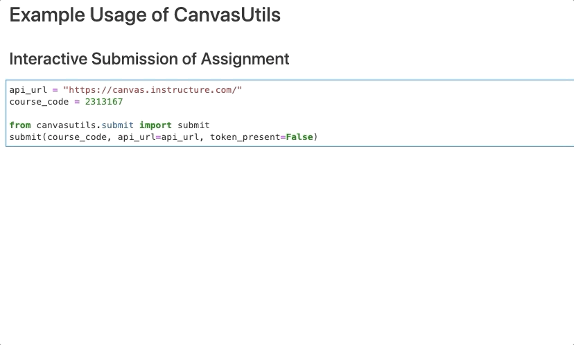

# CanvasUtils

Utilities for interacting with Canvas using Python and the canvasapi.

## Installation

```bash
pip install canvasutils
```

`canvasutils` depends on the `ipywidgets` packages. To make sure widgets render correctly in notebooks, you may need to enable the widgets extension in Jupyter following [these instructions in the ipywidgets docs](https://ipywidgets.readthedocs.io/en/latest/user_install.html#installation), in particular, follow [these instructions](https://ipywidgets.readthedocs.io/en/latest/user_install.html#installing-the-jupyterlab-extension) if using Jupyter Lab.

## Features

- Submit files to Canvas from within a Jupyter notebook.
- Convert files to formats like `.html` from with canvas.
- Create assignments (coming)
- Create assignment rubrics (coming)

## Dependencies

See the file [pyproject.toml](pyproject.toml), `[tool.poetry.dependencies]`.

## Usage

### Assignment Submission in Jupyter

The submit module is made to be used within a Jupyter notebook (.ipynb file):



```python
api_url = "https://canvas.instructure.com/"
course_code = 123456

from canvasutils.submit import submit
submit(course_code, api_url=api_url, token_present=False)  # token present false allows you to enter token interactively.
```

### Notebook Conversion in Jupyter

```python
from canvasutils.submit import convert_notebook
convert_notebook('example.ipynb', to_format="html")

Notebook successfully converted!
```

## Contributors

Contributions are welcomed and recognized. You can see a list of contributors in the [contributors tab](https://github.com/TomasBeuzen/canvasutils/graphs/contributors).

### Credits

This package was originally based on [this repository](https://github.com/eagubsi/JupyterCanvasSubmit) created by Emily Gubski and Steven Wolfram.
